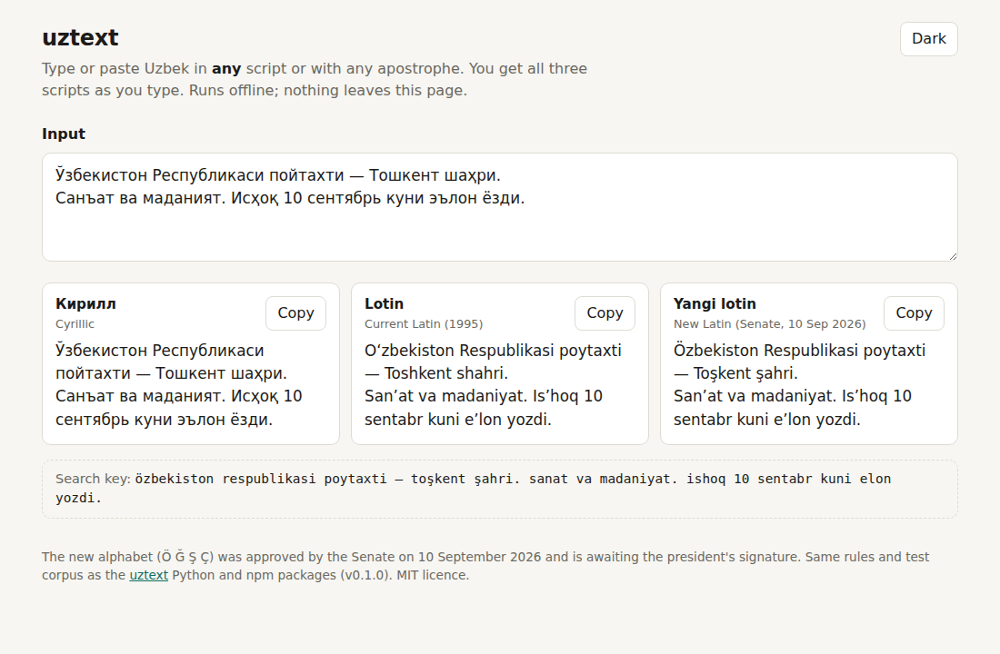

# uztext

A toolkit for Uzbek text in the three scripts now in use:

- **Cyrillic**
- **current Latin**: the 1995 alphabet, with oʻ gʻ sh ch ng and the tutuq belgisi ʼ
- **new Latin**: Oʻ→**Ö**, Gʻ→**Ğ**, Sh→**Ş**, Ch→**Ç**

It converts between them, fixes the apostrophe mess, builds search keys that match across
scripts, and writes amounts in words for invoices.

There are two packages with the same behaviour: **Python** (3.10+, zero dependencies, with a
CLI) and **TypeScript/JavaScript** (ESM + CJS, zero runtime dependencies). They share one
golden test corpus of **699 cases**, and both must pass every case.



`web/index.html` is a single-file demo that works offline. Open it in a browser.

## Reform status

On **10 September 2026** the Senate approved the law changing the Latin alphabet: 28 letters
and one apostrophe (the tutuq belgisi), with NG dropped as a separate letter. It was then sent
to the president. **As of 24 September 2026 it is awaiting the president's signature.** I found
no report of it being signed.
Sources: [Gazeta.uz, 10 Sep 2026](https://www.gazeta.uz/en/2026/09/10/uzb-alphabet/),
[The Times of Central Asia, 11 Sep 2026](https://timesca.com/uzbekistan-latin-alphabet-changes-senate/),
[Kursiv, 25 Aug 2026](https://uz.kursiv.media/en/2026-08-25/four-letter-reform-uzbekistans-new-latin-alphabet-wins-cautious-support/),
[UZA, 15 Sep 2026](https://uza.uz/oz/posts/millat-kelajagiga-qoyilgan-qonuniy-qadam_909315).
[docs/ALPHABET.md](docs/ALPHABET.md) has the details, with quotes, including what the sources
do *not* say yet.

## Install

Python:

```sh
pip install "git+https://github.com/abafaboy/uztext#subdirectory=python"
```

npm: not published yet. Build from a clone:

```sh
git clone https://github.com/abafaboy/uztext
cd uztext/js
npm install
npm test          # builds dist/ (ESM + CJS) and runs the corpus
```

## Use

### Python

```python
from uztext import to_latin, to_cyrillic, to_new, from_new, normalize, search_key, sum_words

to_latin("Ўзбекистон Республикаси")       # 'Oʻzbekiston Respublikasi'
to_latin("ТОШКЕНТ ШАҲРИ")                 # 'TOSHKENT SHAHRI'
to_latin("Исҳоқ санъат ҳақида ёзди")      # 'Isʼhoq sanʼat haqida yozdi'
to_cyrillic("O'zbekiston")                # 'Ўзбекистон'
to_cyrillic("litsey va sirk")             # 'лицей ва цирк'
to_new("Oʻzbekiston, Toshkent shahri")    # 'Özbekiston, Toşkent şahri'
to_new("Isʼhoq")                          # 'Isʼhoq'  (s + tutuq + h is not the digraph sh)
from_new("ŞAHAR")                         # 'SHAHAR'
normalize("O`zbekiston san'at g‘alaba")   # 'Oʻzbekiston sanʼat gʻalaba'
search_key("Ўзбекистон")                  # 'özbekiston', same key for O‘ZBEKISTON, Özbekiston, O'zbekiston
sum_words("1 250 000,50")                 # 'bir million ikki yuz ellik ming soʻm ellik tiyin'
sum_words(1992, script="cyrillic")        # 'бир минг тўққиз юз тўқсон икки сўм'
sum_words(1992, script="new")             # 'bir ming töqqiz yuz töqson ikki söm'
```

### Command line

```console
$ uztext to-latin "Ўзбекистон Республикаси"
Oʻzbekiston Respublikasi
$ echo "O'zbekiston, Toshkent shahri" | uztext to-new
Özbekiston, Toşkent şahri
$ uztext to-cyrillic "Isʼhoq"
Исҳоқ
$ uztext sum-words "1 250 000,50" --script cyrillic
бир миллион икки юз эллик минг сўм эллик тийин
```

Commands: `to-latin`, `to-cyrillic`, `to-new`, `from-new`, `normalize`, `search-key`,
`sum-words`. Text comes from the arguments or, if there are none, from stdin. `python -m uztext`
also works.

### JavaScript / TypeScript

```js
import { toLatin, toCyrillic, toNew, fromNew, normalize, searchKey, sumWords } from "uztext";
// or: const { toLatin } = require("uztext");

toLatin("Ўзбекистон Республикаси");            // "Oʻzbekiston Respublikasi"
toNew("Oʻzbekiston, Toshkent shahri");         // "Özbekiston, Toşkent şahri"
sumWords("1 250 000,50", { script: "cyrillic" }); // "бир миллион икки юз эллик минг сўм эллик тийин"
```

The API is the same as in Python, in camelCase. `sumWords` takes `{ script, currency, subunit }`.

## What it gets right

- **е, ц, ъ, ь, сҳ.**
  - *ер → yer*, *поезд → poyezd*, *поэма → poema*
  - *лицей → litsey*, *цирк → sirk*
  - *маъно → maʼno*, *объект → obyekt*, *мўъжиза → moʻjiza*
  - *Исҳоқ → Isʼhoq* (not *Ishoq*, which would read as ш)
  - *октябрь → oktabr*
- **All caps.** *ШАҲАР → SHAHAR*, but *Шаҳар → Shahar*. The same goes for the new alphabet:
  *ŞAHAR → SHAHAR*.
- **Latin → Cyrillic ambiguity.** *ts/s* could be ц or тс/с, and ь/ъ are lost in Latin. A small
  exception list handles this, and every entry names a dictionary source. There is no guessing.
- **Apostrophes.** Twelve look-alikes (`' ` ´ ‘ ’ ‛ ʻ ʼ ʹ ʽ ′ ＇`) are mapped to the right
  character: U+02BB in oʻ/gʻ, U+02BC for the tutuq. Quote marks around words are left alone.
- **Every rule has a source**, listed in [docs/RULES.md](docs/RULES.md): the 1995 spelling
  rules on lex.uz, Wikipedia, and the Izoh.uz and Imlo.uz dictionaries. Where no source settles a
  rule, it is marked *unverified*, and so are its corpus cases.

## The parity guarantee

[`corpus/cases.json`](corpus/cases.json) is the single source of truth: 699 cases, one per line.

```sh
(cd python && PYTHONPATH=src python3 -m unittest discover -s tests -t .)  # Ran 710 tests … OK
(cd js && npm install && npm test)                                     # tests 705, pass 705
```

Both suites generate one test per corpus case, and CI runs both on every push. A change that
alters behaviour in one language fails the other language's suite until it is ported. The
extra tests check the corpus itself: unique ids, every function covered, and every exception
word exercised.

## Existing libraries

Observed on 24 September 2026.

| | Stars | Language | New alphabet | Notes |
|---|---|---|---|---|
| [kodchi/uzbek-transliterator](https://github.com/kodchi/uzbek-transliterator) | 92 | Python | not mentioned | GPL-2.0; README: "This is a toy experiment. The performance is bad. You should use something else." |
| [diyorbek/lotin-kirill](https://github.com/diyorbek/lotin-kirill) | 28 | JS (npm `lotin-kirill`) | not mentioned | MIT; latest npm release 0.1.5 on 29 Jun 2024; user-supplied exception words |
| [azakapro/alifbo](https://github.com/azakapro/alifbo) | 4 | TypeScript | yes | Cyrillic / old Latin / new Latin, apostrophes, sʼh, search keys |
| [fayyoz24/alifbe](https://github.com/fayyoz24/alifbe) | 0 | Python | yes | MIT; normalisation incl. apostrophes, old↔new Latin, script detection |
| **uztext** | – | Python **and** TypeScript | yes | MIT; one shared 699-case corpus; sourced exception list; amounts in words |

## Limitations

- **The new alphabet is not law yet.** The new spelling rules (for example, whether *Isʼhoq*
  keeps its tutuq) are unpublished. uztext keeps the tutuq, and those cases are tagged
  unverified.
- **Latin → Cyrillic can't be perfect.** Latin drops information (ц vs тс/с, ъ/ь). Unlisted
  loanwords come out letter by letter, for example *militsiya → милитсия* and
  *konveyer → конвеер*. Add them to the exception list, with a source.
- **`normalize` assumes Uzbek text.** A quote after *o* or *g* in English (`'go'`) becomes `goʻ`.
- **`sum_words`** writes *bir yuz* and *bir ming* (see RULES.md) and goes up to 999 999 999 999
  with at most two decimals. It has no ordinals or percentages.
- **Out of scope:** Arabic script (Uzbek Arabic alphabet), Karakalpak, and proper-name
  transliteration conventions (for example passports).

## Contributing

The easiest and most useful contribution is **a corpus case**: a word that uztext gets wrong,
or a tricky word it gets right and should keep getting right. See [CONTRIBUTING.md](CONTRIBUTING.md).

## Oʻzbekcha

**uztext** oʻzbek matni bilan uch yozuvda ishlash uchun kutubxona:

- kirill
- amaldagi lotin (1995)
- yangi lotin alifbosi (Ö, Ğ, Ş, Ç)

Yangi alifboni Senat 2026-yil 10-sentabrda maʼqulladi. Qonun hozircha Prezident imzosini kutmoqda.

- kirill ↔ lotin ↔ yangi lotin transliteratsiyasi (*Исҳоқ → Isʼhoq*, *ШАҲАР → SHAHAR*)
- apostroflarni toʻgʻrilash: oʻ/gʻ uchun ʻ (U+02BB), tutuq belgisi uchun ʼ (U+02BC)
- qidiruv kaliti: *Oʻzbekiston*, *O'zbekiston*, *Ўзбекистон*, *Özbekiston* – hammasi bitta kalit
- summani soʻz bilan yozish: *1 250 000,50 → bir million ikki yuz ellik ming soʻm ellik tiyin*

Python va JavaScript paketlari bitta umumiy test korpusidan (`corpus/cases.json`) oʻtadi. Eng
oson hissa – korpusga yangi soʻz qoʻshish (CONTRIBUTING.md).

## License

MIT © 2026 Abdulfayyod Mukhamedov
